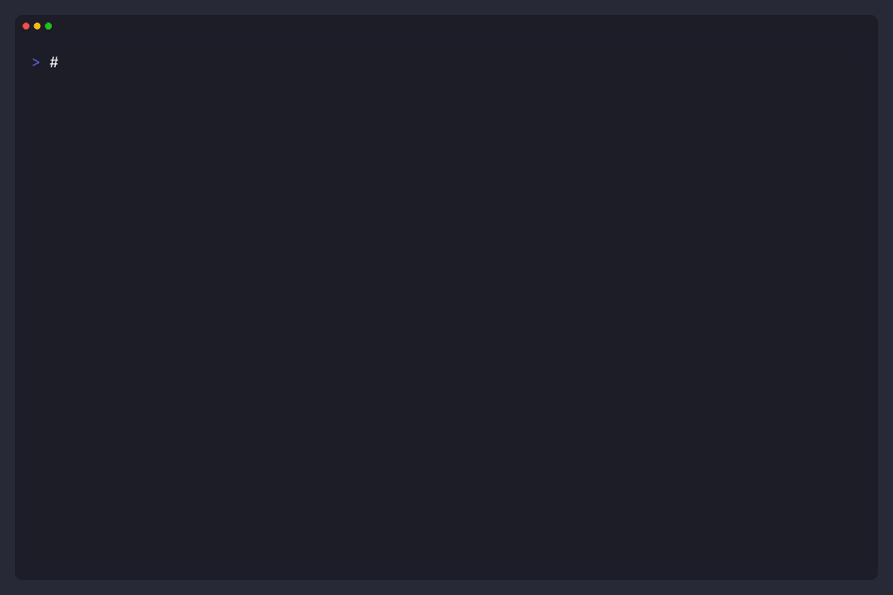

<h1 align="center">gohome</h1>

<p align="center">
  A fast, configurable Git standup & activity reporting CLI written in Go.
</p>

<p align="center">
  <sub>
    Turn your local Git commits across multiple repositories into clean, daily developer reports.
  </sub>
</p>

<p align="center">
  <a href="https://github.com/anIcedAntFA/gohome/actions">
    
  </a>
  <a href="https://codecov.io/gh/anIcedAntFA/gohome">
    
  </a>
  <a href="https://goreportcard.com/report/github.com/anIcedAntFA/gohome">
    
  </a>
  <a href="https://github.com/anIcedAntFA/gohome/releases">
    
  </a>
</p>

<p align="center">
  <a href="https://pkg.go.dev/github.com/anIcedAntFA/gohome">
    
  </a>
  
  
  
</p>

**Forgot what you worked on yesterday?**

**gohome** automates your daily status reporting by recursively scanning your workspace to find git repositories. It aggregates commit logs from multiple projects instantly and formats them into beautiful, ready-to-share reports.

Perfect for **Daily Standups**, **Weekly Summaries**, or tracking your **Personal Coding Habits**.

## 🎬 Quick Demo



*See [docs/demos/](docs/demos/) for more examples and recording guide.*

## ✨ Features

- **🚀 Auto-Discovery:** Recursively finds git repositories in your workspace.
- **⚡ Concurrency:** Scans multiple repos in parallel using Goroutines for maximum speed.
- **🎨 Rich Output:** Supports multiple formats (text, table) and styles (normal, markdown, nature, tech).
- **📋 Clipboard Ready:** Copy reports directly to your system clipboard with `--copy`.
- **📝 Custom Tasks:** Add manual tasks alongside git commits for complete daily reports.
- **⚙️ Smart Config:** Persist your preferences via `~/.gohome.json` or use command-line flags.
- **🔄 Loading Spinner:** Visual feedback during repository scanning.

## 📦 Installation

### Quick Install (Recommended)

**Linux/macOS:**

```bash
curl -sSL https://raw.githubusercontent.com/anIcedAntFA/gohome/main/scripts/install.sh | bash
```

The install script will:

- Auto-detect your platform (Linux/macOS, x86_64/arm64)
- Download the latest release from GitHub
- Install to `/usr/local/bin` (may require sudo)
- Clean up any conflicting dev builds in `$GOPATH/bin`
- Automatically upgrade existing installations when run again

**Windows (PowerShell):**

```powershell
irm https://raw.githubusercontent.com/anIcedAntFA/gohome/main/scripts/install.ps1 | iex
```

The PowerShell script will:

- Auto-detect your architecture (x64/arm64)
- Download and extract the latest release
- Install to `%LOCALAPPDATA%\Programs\gohome`
- Automatically add to PATH
- Clean up conflicting dev builds

### Go Install

If you have Go 1.21+ installed:

```bash
go install github.com/anIcedAntFA/gohome/cmd/gohome@latest
```

> ⚠️ **Path Configuration:** When using production releases (installed via curl or binary download), ensure `/usr/local/bin` comes **before** `$GOPATH/bin` in your `$PATH` to avoid conflicts with dev builds.
>
> **Shell Configuration Examples:**
>
> <details>
> <summary><strong>Bash</strong> (~/.bashrc or ~/.bash_profile)</summary>
>
> ```bash
> # Go environment
> export GOPATH=$HOME/go
> export PATH=$PATH:$GOPATH/bin  # Append GOPATH/bin (lower priority)
> ```
> </details>
>
> <details>
> <summary><strong>Zsh</strong> (~/.zshrc)</summary>
>
> ```zsh
> # Go environment
> export GOPATH=$HOME/go
> export PATH=$PATH:$GOPATH/bin  # Append GOPATH/bin (lower priority)
> ```
> </details>
>
> <details>
> <summary><strong>Fish</strong> (~/.config/fish/config.fish)</summary>
>
> ```fish
> # Go environment
> set -gx GOPATH $HOME/go
> set -gx PATH $PATH $GOPATH/bin  # Append GOPATH/bin (lower priority)
> # Or use fish_add_path for better management:
> # fish_add_path -aP $GOPATH/bin
> ```
> </details>
>
> <details>
> <summary><strong>PowerShell</strong> (Windows - run as Administrator)</summary>
>
> ```powershell
> # Check current PATH
> $env:Path
>
> # Add Go bin to PATH (User level - persists across sessions)
> $goPath = "$env:USERPROFILE\go\bin"
> [Environment]::SetEnvironmentVariable(
>     "Path",
>     [Environment]::GetEnvironmentVariable("Path", "User") + ";$goPath",
>     "User"
> )
>
> # Reload PATH in current session
> $env:Path = [System.Environment]::GetEnvironmentVariable("Path","User")
> ```
>
> Note: The install.ps1 script automatically adds gohome to PATH.
> </details>
>
> After updating your shell config, reload it:
> ```bash
> # Bash
> source ~/.bashrc
> 
> # Zsh
> source ~/.zshrc
> 
> # Fish
> source ~/.config/fish/config.fish
>
> # PowerShell
> $env:Path = [System.Environment]::GetEnvironmentVariable("Path","User")
> ```

### Download Binary

Download pre-built binaries from [GitHub Releases](https://github.com/anIcedAntFA/gohome/releases/latest):

1. Download the appropriate archive for your OS/architecture
2. Extract the binary
3. Move to a directory in your `$PATH`:

**Linux/macOS:**

```bash
# Extract
tar -xzf gohome_*_linux_x86_64.tar.gz
# Move to PATH
sudo mv gohome /usr/local/bin/
# Make executable
chmod +x /usr/local/bin/gohome
```

**Windows:**

```powershell
# Extract the .zip file
# Move gohome.exe to a directory in your PATH
```

### Verify Installation

```bash
gohome --version
# Production release: gohome v1.0.1
# Dev build: gohome abc1234 (commit: abc1234, built: 2026-01-10)
```

The version format differs based on how it was built:

- **Production releases** show clean version only
- **Development builds** include commit hash and build date for debugging

## 🚀 Usage

Simply run the tool in your workspace directory:

```bash
gohome
```

### 🧪 Common Examples

**1️⃣ Basic Usage (Last 1 day)**

```bash
gohome
```

**2️⃣ Look back 3 days**

```bash
gohome -d 3
```

**3️⃣ Generate a Table Report**

```bash
gohome -f table -s markdown
```

**4️⃣ Copy to Clipboard**

This is useful for pasting directly into Slack/Teams/Discord:

```bash
gohome -d 1 --copy
```

**5️⃣ Add Custom Tasks**

Add tasks that aren't tracked in git:

```bash
gohome -t "Meeting: Sprint Planning" -t "Review: PR #123"
```

**6️⃣ Save Settings**

Save your favorite flags as default (so you don't have to type them next time):

```bash
gohome -p /Users/ngockhoi96/workspace -d 1 -f table --save
```

## 🔧 Configuration

**gohome** looks for a config file at `~/.gohome.json`. You can create it manually or use the `--save` flag to auto-generate it.

### Example Config

```json
{
  "hours": 0,
  "days": 1,
  "weeks": 0,
  "months": 0,
  "years": 0,
  "today": false,
  "path": "/Users/ngockhoi96/workspace",
  "author": "ngockhoi96",
  "format": "table",
  "preset": "normal",
  "show_icon": true,
  "show_scope": false,
  "copy_to_clipboard": false,
  "tasks": [
    {
      "type": "meeting",
      "message": "Daily Standup & Team Sync",
      "icon": "📅",
      "enabled": true
    },
    {
      "type": "review",
      "message": "Code Review & PR Feedback",
      "icon": "👀",
      "enabled": true
    }
  ]
}
```

### 🧾 Flags Reference

| Flag       | Alias | Description                                  | Default     |
| ---------- | ----- | -------------------------------------------- | ----------- |
| `--hours`  | `-H`  | Number of hours to look back                 | 0           |
| `--today`  |       | Report from midnight to now                  | false       |
| `--days`   | `-d`  | Number of days to look back                  | 1           |
| `--weeks`  | `-w`  | Number of weeks to look back                 | 0           |
| `--months` | `-m`  | Number of months to look back                | 0           |
| `--years`  | `-y`  | Number of years to look back                 | 0           |
| `--path`   | `-p`  | Root path to scan for repositories           | `.`         |
| `--author` | `-a`  | Git author name (auto-detected)              | System User |
| `--format` | `-f`  | Output format: `text`, `table`               | `text`      |
| `--preset` | `-s`  | Table style: `normal`, `markdown`            |             |
| `--copy`   | `-cp` | Copy output to clipboard                     | false       |
| `--icon`   | `-i`  | Show icon column (table format only)         | false       |
| `--scope`  | `-c`  | Show scope column (table format only)        | false       |
| `--task`   | `-t`  | Add custom task (repeatable)                 | []          |
| `--save`   |       | Save current flags as default config         | false       |
| `--version`| `-v`  | Show version information                     |             |
| `--help`   | `-h`  | Show help message                            |             |

## 🗺️ Roadmap

See [ROADMAP.md](ROADMAP.md) for the full development plan and upcoming features.

## 🤝 Contributing

Contributions are welcome! Please feel free to submit a Pull Request.

1. Fork the project
2. Create your feature branch (`git checkout -b feat/amazing-feature`)
3. Commit your changes (`git commit -m '✨ feat(internal): add some amazing feature'`)
4. Push to the branch (`git push origin feat/amazing-feature`)
5. Open a Pull Request

### 🧑‍💻 Development Setup

```bash
# Clone the repo
git clone https://github.com/anIcedAntFA/gohome.git
cd gohome

# Install dependencies
go mod tidy

# Run locally
go run cmd/gohome/main.go
```

## ❤️ Credits & Motivation

**gohome** is heavily inspired by the awesome [git-standup](https://github.com/kamranahmedse/git-standup) utility by [Kamran Ahmed](https://github.com/kamranahmedse).

While `git-standup` is great, **gohome** was built to address specific personal needs for daily reporting, such as:

- **Rich formatting:** Tables, icons, and custom styles.
- **Workflow integration:** Direct clipboard support.
- **Smart config:** Persisted settings for zero-setup runs.

This project also serves as a practical journey to master **Go (Golang)**, implementing concepts like Concurrency, CLI architecture, and Cross-platform distribution.

## 📄 License

This project is licensed under the MIT License - see the [LICENSE](LICENSE) file for details.