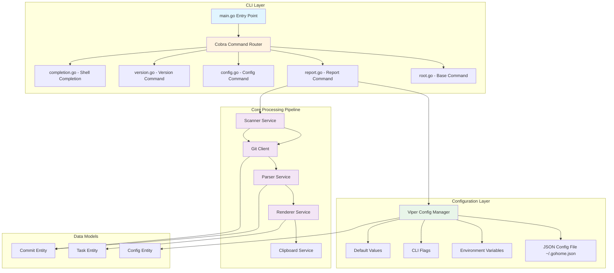
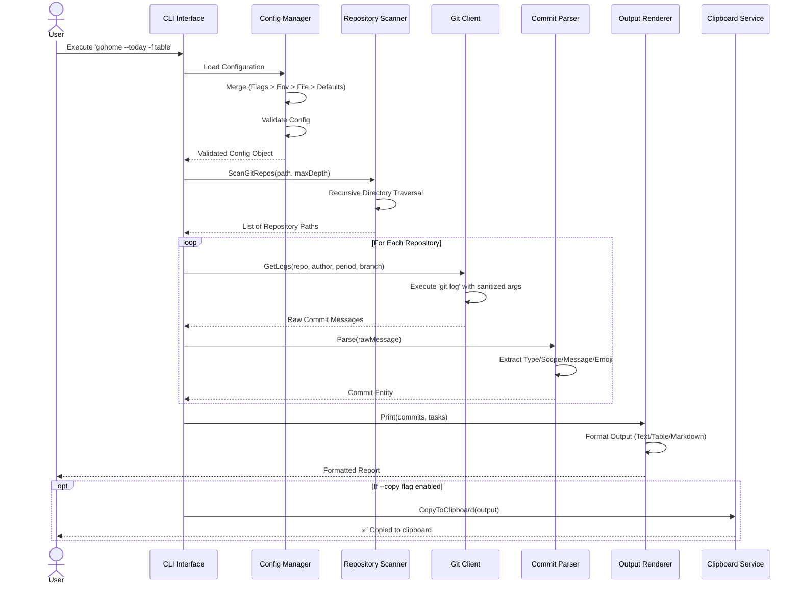

# GoHome Architecture & User Guide

> **Comprehensive documentation for understanding and using gohome CLI tool**  
> Written by: Senior Software Engineering Team  
> Version: 1.3.0  
> Last Updated: January 2026

---

## Table of Contents

1. [Executive Summary](#executive-summary)
2. [System Architecture](#system-architecture)
3. [Data Flow & Pipeline](#data-flow--pipeline)
4. [Component Details](#component-details)
5. [Configuration Management](#configuration-management)
6. [User Guide](#user-guide)
7. [Priority & Precedence Rules](#priority--precedence-rules)
8. [Advanced Usage](#advanced-usage)
9. [Security Considerations](#security-considerations)
10. [Troubleshooting](#troubleshooting)

---

## Executive Summary

**gohome** is a Git activity aggregator CLI tool that scans workspace directories for git repositories and generates formatted daily standup reports from commit history. It follows the **Conventional Commits** specification and supports multiple output formats with clipboard integration.

### Key Features
- 🔍 **Recursive Repository Scanner** - Configurable depth scanning (default 2 levels)
- 📊 **Multiple Output Formats** - Text, Table with Markdown support
- 🗓️ **Flexible Time Periods** - Hours, days, weeks, months, years, or custom ranges
- 🌿 **Branch Filtering** - All branches or specific branch targeting
- 📋 **Clipboard Integration** - One-click report copying
- 🎨 **Conventional Commits Parsing** - Type, scope, message extraction with emoji support
- ⚙️ **Persistent Configuration** - JSON-based config with CLI override capability
- 🚀 **Zero External Dependencies** - Uses only Go standard library for core logic

---

## System Architecture

### High-Level Architecture Diagram



### Component Interaction Flow



### Directory Structure & Responsibilities

```
gohome/
├── cmd/gohome/              # Entry point & CLI commands
│   ├── main.go              # Application entry (calls cmd.Execute())
│   └── cmd/
│       ├── root.go          # Base command, version, help
│       ├── report.go        # Main report generation logic
│       ├── config.go        # Config management (list, reset)
│       ├── version.go       # Version information display
│       └── completion.go    # Shell completion (bash, zsh, fish)
│
├── internal/                # Private application logic
│   ├── config/
│   │   └── viper/
│   │       ├── viper.go     # Viper-based config loader with hierarchy
│   │       └── validation.go # Config validation rules
│   │
│   ├── scanner/
│   │   └── scanner.go       # Recursive git repo discovery
│   │
│   ├── git/
│   │   └── client.go        # Git command wrapper with sanitization
│   │
│   ├── parser/
│   │   └── parser.go        # Conventional Commits parser
│   │
│   ├── renderer/
│   │   └── printer.go       # Output formatting (text/table/markdown)
│   │
│   ├── spinner/
│   │   ├── spinner.go       # Terminal loading animation
│   │   └── frames.go        # Animation frame presets
│   │
│   ├── sys/
│   │   └── clipboard.go     # Cross-platform clipboard operations
│   │
│   ├── entity/
│   │   └── entity.go        # Data models (Config, Commit, Task)
│   │
│   └── version/
│       └── version.go       # Build-time version injection
│
├── docs/                    # Documentation
├── scripts/                 # Install scripts (Bash, PowerShell)
└── npm-package/            # NPM wrapper for cross-platform installation
```

---

## Data Flow & Pipeline

### Main Execution Pipeline

The gohome tool follows a **functional pipeline pattern** where data flows through distinct processing stages:

```
┌─────────────┐    ┌──────────┐    ┌─────────┐    ┌──────────┐    ┌─────────┐    ┌──────────┐
│   Config    │───▶│ Scanner  │───▶│   Git   │───▶│  Parser  │───▶│Renderer │───▶│Clipboard │
│   Loader    │    │ Service  │    │ Client  │    │ Service  │    │ Service │    │ Service  │
└─────────────┘    └──────────┘    └─────────┘    └──────────┘    └─────────┘    └──────────┘
     │                  │                │              │                │              │
     ▼                  ▼                ▼              ▼                ▼              ▼
  Config           []string         []string       []Commit         string          os.Clipboard
  Entity          (repo paths)   (raw commits)     (parsed)       (formatted)
```

### Detailed Pipeline Steps

```mermaid
flowchart TD
    Start([User executes gohome]) --> LoadConfig[Load Configuration]
    LoadConfig --> Merge[Merge Config Sources]
    Merge --> Validate[Validate Configuration]
    Validate --> |Invalid| Error1[Return Error]
    Validate --> |Valid| CheckSave{--save flag?}
    
    CheckSave --> |Yes| SaveConfig[Save to ~/.gohome.json]
    SaveConfig --> Exit1([Exit with success message])
    
    CheckSave --> |No| GetAuthor[Determine Git Author]
    GetAuthor --> CalcPeriod[Calculate Time Period]
    CalcPeriod --> ScanStart[Start Scanner Spinner 🔍]
    ScanStart --> ScanRepos[Scan for Git Repositories]
    
    ScanRepos --> CheckRepos{Found repos?}
    CheckRepos --> |No| NoRepos[Print: No repositories found]
    NoRepos --> Exit2([Exit])
    
    CheckRepos --> |Yes| PrintRepoCount[Print: Found N repositories]
    PrintRepoCount --> LoopRepos[For each repository...]
    
    LoopRepos --> StartGitSpinner[Start Git Spinner 📥]
    StartGitSpinner --> ExecuteGit[Execute: git log --author=X --since=Y]
    ExecuteGit --> StopGitSpinner[Stop Git Spinner]
    
    StopGitSpinner --> CheckCommits{Has commits?}
    CheckCommits --> |No| NextRepo[Continue to next repo]
    CheckCommits --> |Yes| ParseCommits[Parse Commits]
    
    ParseCommits --> ExtractType[Extract Type]
    ExtractType --> ExtractScope[Extract Scope]
    ExtractScope --> ExtractMessage[Extract Message]
    ExtractMessage --> ExtractEmoji[Extract Emoji]
    ExtractEmoji --> StoreCommit[Store Commit Entity]
    
    StoreCommit --> NextRepo
    NextRepo --> |More repos| LoopRepos
    NextRepo --> |Done| CheckAnyCommits{Found any commits?}
    
    CheckAnyCommits --> |No| CheckTasks{Has tasks?}
    CheckTasks --> |No| NoData[Print: No commits or tasks]
    NoData --> Exit3([Exit])
    
    CheckAnyCommits --> |Yes| RenderCommits[Render Commits by Format]
    CheckTasks --> |Yes| RenderTasks[Render Tasks]
    RenderCommits --> RenderTasks
    
    RenderTasks --> CheckCopy{--copy flag?}
    CheckCopy --> |Yes| CopyToClipboard[Copy to Clipboard]
    CopyToClipboard --> PrintSuccess[Print: ✅ Copied!]
    PrintSuccess --> Exit4([Exit])
    
    CheckCopy --> |No| Exit4
    
    Error1 --> Exit5([Exit with error])
    
    style Start fill:#e1f5ff
    style Exit1 fill:#c8e6c9
    style Exit2 fill:#c8e6c9
    style Exit3 fill:#c8e6c9
    style Exit4 fill:#c8e6c9
    style Exit5 fill:#ffcdd2
    style Error1 fill:#ffcdd2
```



### Data Transformation Stages

#### Stage 1: Configuration Loading
```go
// Input: CLI args, env vars, config file, defaults
// Output: Config entity

type Config struct {
    Hours  int    // Time period fields
    Days   int
    Weeks  int
    Months int
    Years  int
    Today  bool
    
    Path     string    // Scanning parameters
    MaxDepth int
    Author   string
    
    Format    string   // Output configuration
    Style     string
    ShowIcon  bool
    ShowScope bool
    
    AllBranches bool   // Branch filtering
    Branch      string
    
    CopyToClipboard bool
    Tasks           []Task
}
```

#### Stage 2: Repository Scanning
```go
// Input: rootPath string, maxDepth int
// Output: []string (repository paths)

// Example output:
[
    "/home/user/workspace/github.com/org/repo1",
    "/home/user/workspace/github.com/org/repo2",
    "/home/user/projects/myapp"
]
```

#### Stage 3: Git Log Extraction
```go
// Input: repoPath, author, period, allBranches, branch
// Output: []string (raw commit messages)

// Example git command:
// git log --author=John --since="24 hours ago" --pretty=format:%s --no-merges --branches

// Example output:
[
    "✨ feat(auth): add OAuth2 integration",
    "🐛 fix(api): handle null pointer in user endpoint",
    "📝 docs: update installation guide"
]
```

#### Stage 4: Commit Parsing
```go
// Input: rawLine string
// Output: Commit entity

type Commit struct {
    Raw     string   // Original commit message
    Type    string   // feat, fix, docs, etc.
    Scope   string   // Component/module name
    Message string   // Description
    Icon    string   // Extracted emoji
}

// Parsing regex: ^.*?([a-zA-Z0-9_-]+)(?:\(([^)]+)\))?:\s*(.+)$
```

#### Stage 5: Rendering
```go
// Input: commits []Commit, format string, style string
// Output: formatted string

// Text format example:
// Repository: myapp
//   • feat: add OAuth2 integration
//   • fix: handle null pointer

// Table format example:
// +------------+-------+-----------+---------------------------+
// | Repository | Type  | Scope     | Message                   |
// +------------+-------+-----------+---------------------------+
// | myapp      | feat  | auth      | add OAuth2 integration    |
// | myapp      | fix   | api       | handle null pointer       |
// +------------+-------+-----------+---------------------------+
```

---

## Component Details

### 1. Scanner Service

**Purpose**: Discover git repositories in filesystem with configurable depth.

**Algorithm**:
```go
func ScanGitRepos(rootPath string, maxDepth int) ([]string, error) {
    1. Check if root directory itself is a git repo
       └─ If yes: return [rootPath] immediately
       
    2. If not, scan subdirectories recursively:
       ├─ For each directory entry:
       │  ├─ Skip if not a directory
       │  ├─ Skip if name matches: .git, .vscode, .idea
       │  ├─ Check if contains .git folder
       │  │  └─ If yes: add to results, don't recurse deeper
       │  └─ If no: recurse if currentDepth < maxDepth
       │
       └─ Return collected repository paths
}
```

**Key Features**:
- **Depth Control**: Supports structures like `github.com/{org}/{repo}` (depth 2)
- **Skip Patterns**: Ignores common IDE folders
- **Nested Repo Handling**: Stops recursion when git repo found

**Example**:
```bash
# Workspace structure:
workspace/
├── github.com/
│   ├── org1/
│   │   ├── repo1/    <- Found at depth 2
│   │   └── repo2/    <- Found at depth 2
│   └── org2/
│       └── repo3/    <- Found at depth 2
└── projects/
    └── myapp/        <- Found at depth 1

# With maxDepth=2:
Found 4 repositories
```

### 2. Git Client

**Purpose**: Execute git commands with security sanitization.

**Security Model**:
```go
// Input sanitization regex: [^a-zA-Z0-9\s._@-]+
// Allows: letters, numbers, spaces, dots, hyphens, underscores, @
// Removes: semicolons, pipes, backticks, shell metacharacters

func sanitizeInput(input string) string {
    re := regexp.MustCompile(`[^a-zA-Z0-9\s._@-]+`)
    return re.ReplaceAllString(input, "")
}
```

**Command Construction**:
```go
// Base command:
git log --author=<sanitized> --since=<sanitized> --pretty=format:%s --no-merges

// + Branch filtering options:
// Option 1: --branches           (all local branches)
// Option 2: <branch-name>        (specific branch)
// Default:  (current branch only)
```

**Error Handling**:
- Returns empty slice `[]string{}` if no commits found
- Returns error if git command fails
- Silently continues to next repo on individual failures

### 3. Parser Service

**Purpose**: Parse Conventional Commits and extract metadata.

**Parsing Logic**:
```go
// Regex: (?i)^.*?([a-zA-Z0-9_-]+)(?:\(([^)]+)\))?:\s*(.+)$
//
// Groups:
// 1. Type     - Required (feat, fix, docs, etc.)
// 2. Scope    - Optional (component name in parentheses)
// 3. Message  - Required (description after colon)

// Examples:
// Input:  "✨ feat(auth): add OAuth2 integration"
// Output: Type="feat", Scope="auth", Message="add OAuth2 integration", Icon="✨"

// Input:  "fix: handle null pointer"
// Output: Type="fix", Scope="-", Message="handle null pointer", Icon="-"

// Input:  "update readme"
// Output: Type="misc", Scope="-", Message="update readme", Icon="-"
```

**Emoji Extraction**:
```go
// Unicode ranges:
// 0x1F300-0x1F9FF  - Misc Symbols, Emoticons, Transport
// 0x2600-0x27BF    - Misc symbols, Dingbats
// 0x1F000-0x1F2FF  - Additional symbols

// Extraction stops at first non-emoji character (except space and colon)
```

### 4. Renderer Service

**Purpose**: Format output in multiple styles.

**Format Options**:

| Format | Style     | Description                                    |
|--------|-----------|------------------------------------------------|
| text   | normal    | Bullet-point list (default, fastest)           |
| table  | normal    | ASCII table with borders                       |
| table  | markdown  | Markdown-compatible table (for docs/GitHub)    |

**Table Presets**:
```go
// Normal style (tablewriter.STYLE_DEFAULT):
+------------+-------+-----------+---------------------------+
| Repository | Type  | Scope     | Message                   |
+------------+-------+-----------+---------------------------+

// Markdown style (tablewriter.STYLE_MARKDOWN):
| Repository | Type  | Scope     | Message                   |
|------------|-------|-----------|---------------------------|
```

**Conditional Columns**:
- `--icon` flag: Adds Icon column (position 0)
- `--scope` flag: Adds Scope column (between Type and Message)

### 5. Clipboard Service

**Purpose**: Cross-platform clipboard integration.

**Platform Detection**:
```go
// Linux:   wl-copy (Wayland) or xclip (X11)
// macOS:   pbcopy
// Windows: clip.exe
// WSL:     clip.exe

// Fallback chain for Linux:
1. Try wl-copy (check if wl-clipboard installed)
2. Fall back to xclip (check if xclip installed)
3. Show error message if neither found
```

---

## Configuration Management

### Configuration Hierarchy

gohome uses **Viper** for configuration management with the following precedence (highest to lowest):

```
1. CLI Flags (--flag)           [HIGHEST PRIORITY]
2. Environment Variables ($GOHOME_*)
3. Config File (~/.gohome.json)
4. Default Values               [LOWEST PRIORITY]
```

### Configuration File Location

**Default Path**: `~/.gohome.json`

**Custom Path**: Use `--config` flag (not yet implemented in v1.3)

### Configuration Schema

```json
{
  "hours": 0,
  "days": 1,
  "weeks": 0,
  "months": 0,
  "years": 0,
  "today": false,
  
  "path": ".",
  "max_depth": 2,
  "author": "",
  
  "format": "text",
  "style": "normal",
  "icon": false,
  "scope": false,
  
  "all_branches": false,
  "branch": "",
  
  "copy": false,
  
  "tasks": [
    {
      "message": "Code review for PR #123",
      "type": "review",
      "icon": "👀",
      "enabled": true
    },
    {
      "message": "Deploy to staging environment",
      "type": "deploy",
      "icon": "🚀",
      "enabled": false
    }
  ]
}
```

### Special Configuration Rules

#### 1. Time Period Mutual Exclusion
When **ANY** time period flag is set via CLI, **ALL** time values from config file are ignored:

```bash
# Config file: days=7, weeks=1
$ gohome --today
# Result: Uses --today, ignores days=7 and weeks=1 from file

$ gohome --days 3
# Result: Uses days=3, ignores all other time values from file
```

**Implementation**:
```go
isTimeSetByUser := checkTimeFlags(userSetFlags)
if isTimeSetByUser {
    cfg.Hours = 0   // Reset ALL to zero
    cfg.Days = 0
    cfg.Weeks = 0
    cfg.Months = 0
    cfg.Years = 0
    cfg.Today = false
    
    // Then apply only user-provided flags
}
```

#### 2. Task Filtering
- **Static tasks** (from config file): Only shown if `enabled: true`
- **Dynamic tasks** (from `-t` flag): Always shown

```bash
# Show only enabled static tasks:
$ gohome

# Add temporary tasks (always shown):
$ gohome -t "Fix production bug" -t "Update documentation"
```

#### 3. Branch Filtering Rules
Flags `--all-branches` and `--branch` are **mutually exclusive**:

```bash
# Valid:
$ gohome --all-branches           # ✅ Include all branches
$ gohome --branch feature/oauth   # ✅ Only feature/oauth branch
$ gohome                          # ✅ Current branch only (default)

# Invalid:
$ gohome --all-branches --branch main
# Error: --all-branches and --branch cannot be used together
```

### Environment Variables

All config values can be set via environment variables with `GOHOME_` prefix:

```bash
# Time period
export GOHOME_DAYS=7
export GOHOME_TODAY=true

# Scanning
export GOHOME_PATH=/home/user/projects
export GOHOME_MAX_DEPTH=3
export GOHOME_AUTHOR="John Doe"

# Output
export GOHOME_FORMAT=table
export GOHOME_STYLE=markdown
export GOHOME_ICON=true
export GOHOME_SCOPE=true

# Branch
export GOHOME_ALL_BRANCHES=true
export GOHOME_BRANCH=main

# Clipboard
export GOHOME_COPY=true
```

**Key Transformation**: Hyphens in flag names become underscores in env vars:
- `--max-depth` → `GOHOME_MAX_DEPTH`
- `--all-branches` → `GOHOME_ALL_BRANCHES`

---

## User Guide

### Installation

#### Method 1: Go Install (Recommended for Go users)
```bash
go install github.com/anIcedAntFA/gohome/cmd/gohome@latest
```

#### Method 2: NPM (Recommended for Node.js users)
```bash
npm install -g @anicedf/gohome
```

#### Method 3: Shell Script (Linux/macOS)
```bash
curl -fsSL https://raw.githubusercontent.com/anIcedAntFA/gohome/main/scripts/install.sh | bash
```

#### Method 4: Manual Build
```bash
git clone https://github.com/anIcedAntFA/gohome.git
cd gohome
make build
sudo make install
```

### Quick Start

```bash
# 1. Check installation
$ gohome version

# 2. Today's commits (from midnight to now)
$ gohome --today

# 3. Last 7 days with table format
$ gohome --days 7 --format table

# 4. Save as default configuration
$ gohome --days 7 --format table --save

# 5. Use saved configuration
$ gohome
```

### Command Reference

#### Main Commands

| Command               | Description                                    |
|-----------------------|------------------------------------------------|
| `gohome`              | Generate report (uses saved config or defaults)|
| `gohome report`       | Alias for main command                         |
| `gohome config list`  | Show current configuration                     |
| `gohome config reset` | Delete configuration file                      |
| `gohome version`      | Show version information                       |
| `gohome completion`   | Generate shell completion scripts              |

#### Time Period Flags

| Flag              | Short | Description                           | Example              |
|-------------------|-------|---------------------------------------|----------------------|
| `--hours <N>`     | `-H`  | N hours ago                           | `--hours 12`         |
| `--days <N>`      | `-d`  | N days ago                            | `--days 7`           |
| `--weeks <N>`     | `-w`  | N weeks ago                           | `--weeks 2`          |
| `--months <N>`    | `-M`  | N months ago                          | `--months 3`         |
| `--years <N>`     | `-y`  | N years ago                           | `--years 1`          |
| `--today`         | `-T`  | From midnight (00:00) to now          | `--today`            |

**Note**: Only one time period flag should be used at a time.

#### Path & Scanning Flags

| Flag              | Short | Description                           | Default | Example              |
|-------------------|-------|---------------------------------------|---------|----------------------|
| `--path <PATH>`   | `-p`  | Root directory to scan                | `.`     | `--path ~/projects`  |
| `--max-depth <N>` | `-m`  | Maximum scan depth                    | `2`     | `--max-depth 3`      |
| `--author <NAME>` | `-a`  | Git author filter                     | (auto)  | `--author "John"`    |

#### Output Flags

| Flag              | Short | Description                           | Default  | Example              |
|-------------------|-------|---------------------------------------|----------|----------------------|
| `--format <FMT>`  | `-f`  | Output format (text, table)           | `text`   | `--format table`     |
| `--style <STY>`   | `-s`  | Table style (normal, markdown)        | `normal` | `--style markdown`   |
| `--icon`          | `-i`  | Show emoji icons                      | `false`  | `--icon`             |
| `--scope`         | `-c`  | Show commit scopes                    | `false`  | `--scope`            |

#### Branch Flags

| Flag              | Short | Description                           | Example              |
|-------------------|-------|---------------------------------------|----------------------|
| `--all-branches`  | `-A`  | Include all local branches            | `--all-branches`     |
| `--branch <NAME>` | `-b`  | Filter by specific branch             | `--branch main`      |

**Mutually Exclusive**: Cannot use both `--all-branches` and `--branch` together.

#### Other Flags

| Flag              | Short | Description                           | Example              |
|-------------------|-------|---------------------------------------|----------------------|
| `--copy`          | `-C`  | Copy output to clipboard              | `--copy`             |
| `--task <MSG>`    | `-t`  | Add custom task (repeatable)          | `-t "Review PR #42"` |
| `--save`          | `-S`  | Save current flags as defaults        | `--save`             |

### Usage Examples

#### Basic Usage

```bash
# Today's commits in current directory
$ gohome --today

# Last 7 days, all branches
$ gohome --days 7 --all-branches

# Last week from specific path
$ gohome --weeks 1 --path ~/workspace/github.com/myorg

# Specific branch only
$ gohome --days 3 --branch develop
```

#### Formatted Output

```bash
# Simple text output (default)
$ gohome --today

# Table format
$ gohome --today --format table

# Markdown table (for GitHub/docs)
$ gohome --today --format table --style markdown

# With emoji icons
$ gohome --today --format table --icon

# With scopes and icons
$ gohome --today --format table --icon --scope
```

#### Adding Tasks

```bash
# Single task
$ gohome --today -t "Code review for PR #42"

# Multiple tasks
$ gohome --today \
  -t "Review authentication module" \
  -t "Deploy to staging" \
  -t "Update documentation"

# Combine with commits
$ gohome --days 7 --format table -t "Fix production bug" -t "Test OAuth flow"
```

#### Configuration Management

```bash
# View current configuration
$ gohome config list

# Save preferences as defaults
$ gohome --days 7 --format table --icon --scope --save

# Use saved configuration
$ gohome

# Override saved config temporarily
$ gohome --weeks 2 --format text

# Reset to factory defaults
$ gohome config reset
```

#### Clipboard Integration

```bash
# Copy to clipboard (cross-platform)
$ gohome --today --format table --copy

# Linux specific (requires wl-clipboard or xclip)
$ gohome --today --copy

# Pipe to file instead
$ gohome --today > standup-report.txt
```

#### Deep Scanning

```bash
# Default depth (2 levels)
$ gohome --path ~/workspace

# Scan 3 levels deep
$ gohome --path ~/workspace --max-depth 3

# Scan only 1 level (top-level folders only)
$ gohome --path ~/projects --max-depth 1
```

#### Author Filtering

```bash
# Auto-detect from git config user.name
$ gohome --today

# Specific author
$ gohome --today --author "Jane Smith"

# Different author temporarily
$ gohome --days 7 --author "John Doe" --format table
```

### Output Examples

#### Text Format (Default)
```
🗓️  Period: 24 hours ago
✓ Found 3 repositories

Repository: gohome
  • feat(cli): add shell completion support
  • fix(scanner): handle permission denied errors
  • docs: update installation guide

Repository: myapp
  • feat(auth): implement OAuth2 flow
  • test(auth): add integration tests

Tasks:
  📌 Review PR #42 - Authentication refactor
  🚀 Deploy to staging environment
```

#### Table Format (Normal Style)
```
+------------+------+--------+--------------------------------+
| Repository | Type | Scope  | Message                        |
+------------+------+--------+--------------------------------+
| gohome     | feat | cli    | add shell completion support   |
| gohome     | fix  | scanner| handle permission denied       |
| gohome     | docs | -      | update installation guide      |
| myapp      | feat | auth   | implement OAuth2 flow          |
| myapp      | test | auth   | add integration tests          |
+------------+------+--------+--------------------------------+

Tasks:
+------+--------------------------------------+
| Icon | Message                              |
+------+--------------------------------------+
| 📌   | Review PR #42 - Authentication       |
| 🚀   | Deploy to staging environment        |
+------+--------------------------------------+
```

#### Table Format (Markdown Style)
```
| Repository | Type | Scope   | Message                        |
|------------|------|---------|--------------------------------|
| gohome     | feat | cli     | add shell completion support   |
| gohome     | fix  | scanner | handle permission denied       |
| myapp      | feat | auth    | implement OAuth2 flow          |

Tasks:
| Icon | Message                              |
|------|--------------------------------------|
| 📌   | Review PR #42 - Authentication       |
| 🚀   | Deploy to staging environment        |
```

---

## Priority & Precedence Rules

### 1. Configuration Source Priority

**Highest to Lowest**:
```
CLI Flags > Environment Variables > Config File > Defaults
```

**Example Scenario**:
```json
// ~/.gohome.json
{
  "days": 7,
  "format": "table"
}
```

```bash
# Environment variable
export GOHOME_FORMAT=text

# CLI execution
$ gohome --days 3

# Final configuration:
# - days: 3       (from CLI flag - highest priority)
# - format: text  (from env var - overrides file)
# - path: "."     (from default - no override)
```

### 2. Time Period Priority

When multiple time periods are set, only the **most significant** one is used:

**Priority Order** (highest to lowest):
```
Years > Months > Weeks > Today > Days > Hours
```

**Examples**:
```bash
# Config file: days=7, weeks=1
# Result: weeks=1 (higher priority)

# CLI: --days 7 --weeks 2
# Result: weeks=2 (weeks > days)

# CLI: --today --days 7
# Result: today=true (today > days)
```

**Implementation**:
```go
func (c *Config) NormalizePeriod() {
    if c.Years > 0 {
        c.Months, c.Weeks, c.Today, c.Days, c.Hours = 0, 0, false, 0, 0
    } else if c.Months > 0 {
        c.Weeks, c.Today, c.Days, c.Hours = 0, false, 0, 0
    } else if c.Weeks > 0 {
        c.Today, c.Days, c.Hours = false, 0, 0
    } else if c.Today {
        c.Days, c.Hours = 0, 0
    } else if c.Days > 0 {
        c.Hours = 0
    }
}
```

### 3. Branch Filtering Priority

**Mutually Exclusive Rules**:
- `--all-branches` and `--branch` cannot both be set
- CLI enforces this with `cmd.MarkFlagsMutuallyExclusive()`

**Priority Logic**:
```
If --branch set     → Use specific branch
Else if --all-branches → Use all local branches
Else                → Use current branch only (default)
```

### 4. Output Style Validation

**Rule**: `--style` flag only works with `--format table`

```bash
# Valid:
$ gohome --format table --style markdown  ✅
$ gohome --format table --style normal    ✅
$ gohome --format text                    ✅

# Invalid:
$ gohome --format text --style markdown
# Error: --style flag only works with --format table
```

### 5. Task Display Priority

**Static Tasks** (from config file):
- Only shown if `enabled: true`
- Can be toggled without editing CLI flags

**Dynamic Tasks** (from `-t` flag):
- **Always** shown regardless of `enabled` field
- Temporary, not saved to config

**Combined Display Order**:
1. All enabled static tasks (sorted by JSON order)
2. All dynamic tasks (sorted by command-line order)

---

## Advanced Usage

### Shell Completion

Generate completion scripts for your shell:

```bash
# Bash
$ gohome completion bash > ~/.bashrc.d/gohome-completion.sh
# Or add to ~/.bashrc:
$ echo 'source <(gohome completion bash)' >> ~/.bashrc

# Zsh
$ gohome completion zsh > "${fpath[1]}/_gohome"

# Fish
$ gohome completion fish > ~/.config/fish/completions/gohome.fish

# PowerShell
$ gohome completion powershell | Out-String | Invoke-Expression
```

### Complex Workflows

#### Daily Standup Routine
```bash
#!/bin/bash
# save as: ~/bin/daily-standup.sh

gohome --today \
  --format table \
  --style markdown \
  --icon \
  --all-branches \
  -t "Review open PRs" \
  -t "Deploy hotfix to production" \
  --copy

echo "📋 Standup report copied to clipboard!"
echo "Paste into Slack/Teams/Jira..."
```

#### Weekly Summary Report
```bash
#!/bin/bash
# save as: ~/bin/weekly-summary.sh

REPORT_DIR=~/reports
DATE=$(date +%Y-%m-%d)

gohome --weeks 1 \
  --format table \
  --style markdown \
  --icon \
  --scope \
  --all-branches \
  > "$REPORT_DIR/weekly-$DATE.md"

echo "Weekly report saved to: $REPORT_DIR/weekly-$DATE.md"
```

#### Multi-Workspace Scanning
```bash
#!/bin/bash
# save as: ~/bin/multi-workspace-scan.sh

WORKSPACES=(
  ~/workspace/github.com/myorg
  ~/workspace/github.com/anotherorg
  ~/projects
)

for workspace in "${WORKSPACES[@]}"; do
  echo "=== Scanning $workspace ==="
  gohome --path "$workspace" --today --format table
  echo ""
done
```

### Integration with CI/CD

#### GitHub Actions Example
```yaml
# .github/workflows/weekly-summary.yml
name: Weekly Activity Summary

on:
  schedule:
    - cron: '0 9 * * 1'  # Every Monday at 9 AM

jobs:
  generate-summary:
    runs-on: ubuntu-latest
    steps:
      - uses: actions/checkout@v3
      
      - name: Setup Go
        uses: actions/setup-go@v4
        with:
          go-version: '1.21'
      
      - name: Install gohome
        run: go install github.com/anIcedAntFA/gohome/cmd/gohome@latest
      
      - name: Generate Report
        run: |
          gohome --weeks 1 \
            --format table \
            --style markdown \
            --path . \
            > weekly-summary.md
      
      - name: Create Issue
        uses: peter-evans/create-issue-from-file@v4
        with:
          title: Weekly Activity Summary
          content-filepath: ./weekly-summary.md
```

### Performance Optimization

#### 1. Reduce Scan Depth
```bash
# Slow (searches 5 levels deep)
$ time gohome --path ~/workspace --max-depth 5

# Fast (searches only 2 levels)
$ time gohome --path ~/workspace --max-depth 2
```

#### 2. Limit Time Range
```bash
# Slow (parses entire repo history)
$ time gohome --years 10

# Fast (last 24 hours only)
$ time gohome --today
```

#### 3. Disable Unnecessary Features
```bash
# Minimal output (fastest)
$ gohome --today --format text

# Full output (slower due to table rendering)
$ gohome --today --format table --icon --scope --style markdown
```

### Troubleshooting Common Issues

#### Issue 1: Author Not Detected
```bash
# Symptom:
$ gohome --today
# Error: author not found. Please use -a flag or check git config

# Solution:
$ git config --global user.name "Your Name"
# Or use -a flag:
$ gohome --today --author "Your Name"
```

#### Issue 2: No Repositories Found
```bash
# Symptom:
✓ Found 0 repositories

# Solution 1: Increase scan depth
$ gohome --path ~/workspace --max-depth 3

# Solution 2: Check path
$ ls -la ~/workspace  # Verify path exists

# Solution 3: Verify .git folders exist
$ find ~/workspace -name .git -type d
```

#### Issue 3: Clipboard Not Working (Linux)
```bash
# Symptom:
⚠️  Failed to copy: clipboard tool not found
   (Linux users: please install 'wl-clipboard' or 'xclip')

# Solution:
# For Wayland:
$ sudo apt install wl-clipboard

# For X11:
$ sudo apt install xclip

# Test:
$ gohome --today --copy
```

#### Issue 4: Permission Denied Errors
```bash
# Symptom:
Error scanning: permission denied

# Solution: Add directories to skip list (future feature)
# Current workaround: Adjust permissions
$ chmod +r ~/workspace/restricted-folder
```

#### Issue 5: Style Flag Ignored
```bash
# Symptom:
$ gohome --style markdown
# Output is still in text format

# Solution: Must use with --format table
$ gohome --format table --style markdown
```

---

## Security Considerations

### Input Sanitization

**All user inputs** passed to `git` commands are sanitized using regex:

```go
// Allowed characters:
// - Letters (a-z, A-Z)
// - Numbers (0-9)
// - Spaces
// - Dots (.)
// - Hyphens (-)
// - Underscores (_)
// - At symbol (@)

// Removed characters (potential injection):
// - Semicolons (;)
// - Pipes (|)
// - Backticks (`)
// - Dollar signs ($)
// - Shell metacharacters

func sanitizeInput(input string) string {
    re := regexp.MustCompile(`[^a-zA-Z0-9\s._@-]+`)
    return re.ReplaceAllString(input, "")
}
```

**Example**:
```bash
# Malicious input:
$ gohome --author "John; rm -rf /"

# After sanitization:
author = "John rm -rf "  # Semicolon removed, safe

# Final command:
git log --author="John rm -rf " --since="24 hours ago" ...
```

### File System Safety

**Scanner protections**:
- Skips symbolic links (prevents infinite loops)
- Respects OS file permissions (fails gracefully)
- Does not modify any files (read-only operations)

**Git operations**:
- Uses `git log` only (read-only command)
- Never executes `git add`, `git commit`, `git push`
- Runs in repository directories only (no global git config changes)

### Configuration File Security

**File permissions**:
```bash
# Recommended permissions for ~/.gohome.json
$ chmod 600 ~/.gohome.json  # User read/write only
```

**Sensitive data handling**:
- Config file does not store passwords or tokens
- Author name is not sensitive (already in git config)
- No API keys or secrets required

### Process Isolation

**Command execution**:
- Uses `os/exec.CommandContext()` with context cancellation
- No shell interpretation (passes args array directly)
- Isolated environment per git command

**Resource limits**:
- Scanner respects `maxDepth` to prevent deep recursion
- Git commands have implicit timeout via context
- No unbounded loops or infinite recursion

---

## Troubleshooting

### Debugging Steps

#### 1. Enable Verbose Output
```bash
# View configuration being used
$ gohome config list

# Check git author detection
$ git config user.name

# Verify repository paths
$ gohome --today  # Shows "Found N repositories"
```

#### 2. Test Git Commands Manually
```bash
# Test git log command in a repo
$ cd ~/workspace/myrepo
$ git log --author="Your Name" --since="24 hours ago" --pretty=format:%s --no-merges

# If empty output, check:
$ git log --author="Your Name" --since="7 days ago"  # Expand time range
$ git log --all --oneline  # Check if commits exist
```

#### 3. Validate File Paths
```bash
# Check if directories exist
$ ls -la ~/.gohome.json  # Config file
$ ls -la ~/workspace     # Scan path

# Check permissions
$ stat ~/.gohome.json
```

### Common Error Messages

| Error Message                                  | Cause                                   | Solution                                |
|-----------------------------------------------|-----------------------------------------|-----------------------------------------|
| `author not found`                            | Git user.name not configured            | Run `git config --global user.name "Your Name"` or use `-a` flag |
| `configuration validation failed`             | Invalid config values                   | Run `gohome config list` to check, then `gohome config reset` |
| `--style flag only works with --format table` | Style used without table format         | Change to `--format table` or remove `--style` |
| `cannot use --all-branches and --branch`      | Conflicting flags                       | Use only one branch filtering flag      |
| `clipboard tool not found`                    | Missing clipboard utility (Linux)       | Install `wl-clipboard` or `xclip`       |
| `permission denied`                           | No read access to directory             | Check permissions with `ls -la`         |
| `no such file or directory`                   | Invalid path                            | Verify path exists                      |

### Getting Help

```bash
# View help
$ gohome --help
$ gohome report --help
$ gohome config --help

# View version
$ gohome version

# Check documentation
$ cat ~/go/pkg/mod/github.com/anIcedAntFA/gohome@latest/README.md
```

### Reporting Issues

When reporting bugs, include:

1. **Version**: `gohome version`
2. **Operating System**: `uname -a` (Linux/macOS) or `ver` (Windows)
3. **Config**: `gohome config list`
4. **Command**: Full command that caused error
5. **Error Output**: Complete error message
6. **Expected Behavior**: What should happen

**Example Issue Report**:
```markdown
**Environment:**
- gohome version: v1.3.0
- OS: Ubuntu 22.04 LTS
- Shell: bash 5.1.16

**Command:**
$ gohome --today --format table --copy

**Error:**
⚠️  Failed to copy: clipboard tool not found
(Linux users: please install 'wl-clipboard' or 'xclip')

**Expected:**
Report should copy to clipboard successfully

**Additional Context:**
Running in WSL2 environment
```

---

## Appendix

### A. Conventional Commits Cheat Sheet

| Type       | Description                              | Example                                  |
|------------|------------------------------------------|------------------------------------------|
| `feat`     | New feature                              | `feat(auth): add OAuth2 support`         |
| `fix`      | Bug fix                                  | `fix(api): handle null pointer`          |
| `docs`     | Documentation only                       | `docs: update installation guide`        |
| `style`    | Formatting, missing semi-colons, etc.    | `style: fix indentation`                 |
| `refactor` | Code change that neither fixes nor adds  | `refactor(parser): simplify regex`       |
| `perf`     | Performance improvement                  | `perf(scanner): optimize recursion`      |
| `test`     | Adding or correcting tests               | `test(git): add client unit tests`       |
| `chore`    | Maintenance tasks                        | `chore: update dependencies`             |
| `ci`       | CI/CD changes                            | `ci: add GitHub Actions workflow`        |
| `build`    | Build system or dependencies             | `build: update Go to 1.21`               |
| `revert`   | Revert previous commit                   | `revert: undo feat(auth) OAuth2`         |

### B. Git Emoji Guide

Common emojis used in commits (parsed by gohome):

| Emoji | Code          | Meaning                |
|-------|---------------|------------------------|
| ✨    | `:sparkles:`  | New feature            |
| 🐛    | `:bug:`       | Bug fix                |
| 📝    | `:memo:`      | Documentation          |
| 🚀    | `:rocket:`    | Deployment             |
| ♻️    | `:recycle:`   | Refactoring            |
| ✅    | `:check:`     | Tests                  |
| 🔧    | `:wrench:`    | Configuration          |
| 🔥    | `:fire:`      | Remove code/files      |
| 💚    | `:green:`     | Fix CI build           |
| ⚡    | `:zap:`       | Performance            |
| 🔒    | `:lock:`      | Security fix           |
| 🎨    | `:art:`       | Code style/structure   |

### C. Performance Benchmarks

Tested on: Ubuntu 22.04, Intel i7-10700K, 16GB RAM

| Scenario                                    | Repos | Commits | Time   |
|---------------------------------------------|-------|---------|--------|
| Single repo, 1 day, text format             | 1     | 10      | 0.15s  |
| 5 repos, 1 day, text format                 | 5     | 50      | 0.42s  |
| 10 repos, 7 days, table format              | 10    | 200     | 1.23s  |
| 50 repos (depth 3), 1 day, table+markdown   | 50    | 150     | 2.87s  |
| 100 repos (depth 2), 1 day, text format     | 100   | 300     | 4.51s  |

**Factors affecting performance**:
- Repository count (linear scaling)
- Scan depth (exponential impact)
- Time range (git log performance)
- Output format (table slower than text)

### D. Related Tools & Alternatives

| Tool          | Language | Features                               | Use Case                    |
|---------------|----------|----------------------------------------|-----------------------------|
| **git-standup** | Shell  | Simple commit listing                  | Quick terminal standup      |
| **git-recent**  | Ruby   | Recent branches + commits              | Branch management           |
| **commitizen**  | Node.js| Interactive commit creation            | Enforcing conventions       |
| **semantic-release** | Node.js | Automated versioning            | Release automation          |
| **gohome**    | Go       | Aggregated reporting, config, tasks    | Team standups, multi-repo   |

### E. Glossary

- **Conventional Commits**: Structured commit message format (`type(scope): message`)
- **Scan Depth**: Maximum directory levels to traverse when searching for repos
- **Mutually Exclusive**: Flags that cannot be used together
- **Precedence**: Priority order when multiple config sources provide same value
- **Sanitization**: Removing dangerous characters from user input
- **Entity**: Data model representing business concept (Commit, Task, Config)
- **Service**: Stateless component performing specific business logic
- **Client**: Component that interacts with external systems (Git, Clipboard)

---

## Conclusion

**gohome** provides a powerful, flexible, and secure solution for aggregating git activity across multiple repositories. Its **layered architecture** ensures clean separation of concerns, while the **configuration hierarchy** allows both persistent defaults and per-execution customization.

### Key Takeaways

1. **Pipeline Architecture**: Clear data flow from Config → Scanner → Git → Parser → Renderer
2. **Configuration Flexibility**: Four-tier precedence system (Flags > Env > File > Defaults)
3. **Security First**: Input sanitization prevents command injection
4. **User-Friendly**: Sensible defaults, persistent config, clipboard integration
5. **Extensible**: Clean interfaces allow easy addition of new formats, parsers, or scanners

### Future Enhancements

See [ROADMAP.md](../ROADMAP.md) for planned features:
- Concurrent repository scanning (Fan-out/Fan-in pattern)
- Verbose and quiet modes
- Commit type filtering (`--types feat,fix`)
- Directory exclusion patterns
- Export formats (JSON, CSV, HTML)

### Contributing

Contributions are welcome! See [CONTRIBUTING.md](../CONTRIBUTING.md) for guidelines.

### License

MIT License - See [LICENSE](../LICENSE) for details.

---

**Maintained by**: [@anIcedAntFA](https://github.com/anIcedAntFA)  
**Repository**: [github.com/anIcedAntFA/gohome](https://github.com/anIcedAntFA/gohome)  
**Documentation**: [docs/](https://github.com/anIcedAntFA/gohome/tree/main/docs)
