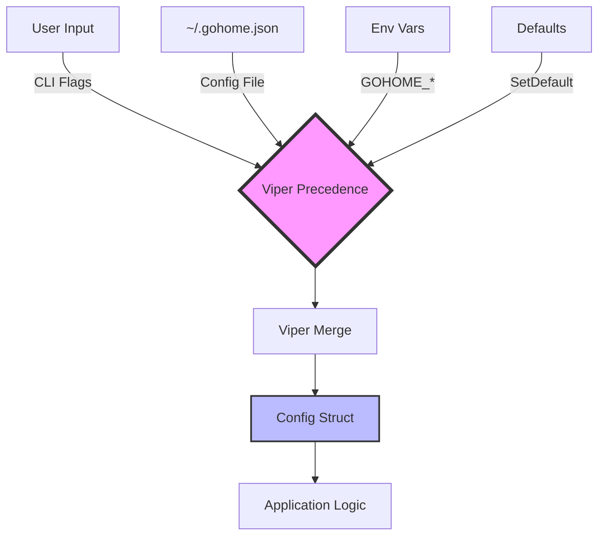
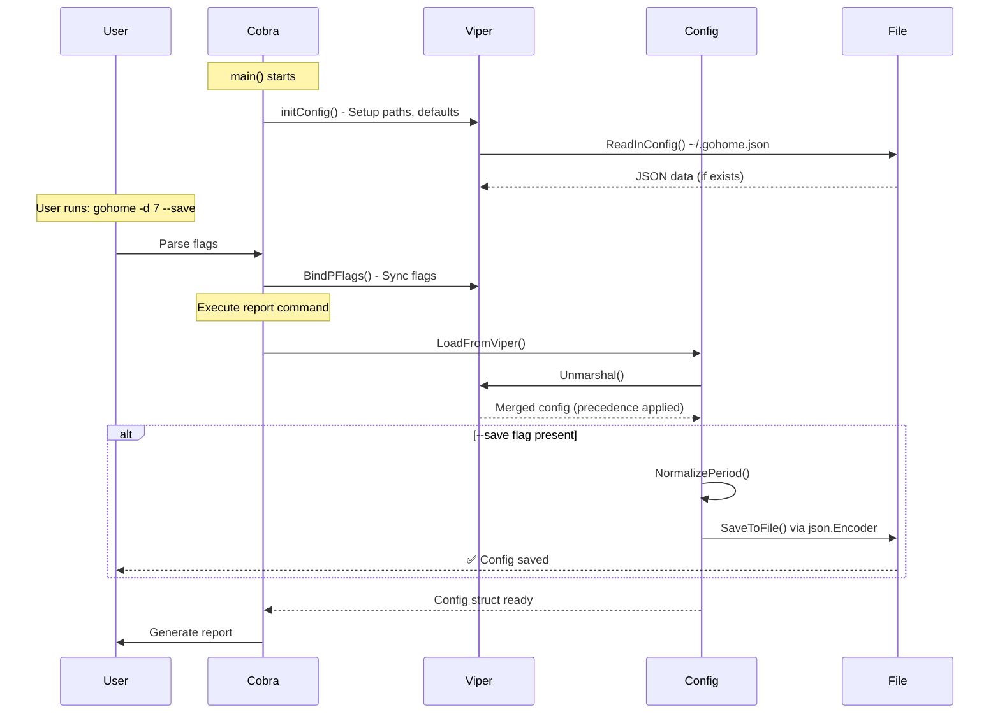

# Viper Configuration Management in gohome

> **Comprehensive guide to configuration management using Viper in gohome CLI**

## Table of Contents

- [Overview](#overview)
- [Architecture](#architecture)
- [Configuration Precedence](#configuration-precedence)
- [Implementation Flow](#implementation-flow)
- [Best Practices](#best-practices)
- [Common Patterns](#common-patterns)
- [Troubleshooting](#troubleshooting)

---

## Overview

**Viper** is a complete configuration solution for Go applications that handles:
- Setting defaults
- Reading from config files (JSON, YAML, TOML, etc.)
- Reading from environment variables  
- Reading from command-line flags (via pflag/Cobra)
- Live watching and re-reading config files
- Setting explicit values programmatically

### Why Viper?

gohome uses Viper to provide a **flexible, hierarchical configuration system** where users can:
1. Use CLI flags for one-time overrides (`gohome -d 7`)
2. Save preferred settings to `~/.gohome.json` (`gohome --save`)
3. Override via environment variables (`GOHOME_DAYS=7`)
4. Benefit from sensible defaults

---

## Architecture

### File Structure

```
gohome/
├── cmd/gohome/
│   ├── main.go                    # Entry point
│   └── cmd/
│       ├── root.go                # Viper initialization (initConfig)
│       ├── report.go              # Report command + flags definition
│       └── config.go              # Config management subcommands
│
└── internal/config/viper/
    └── viper.go                   # Config struct + business logic
```

### Component Responsibilities

| Component | Responsibility |
|-----------|---------------|
| `root.go` | Viper initialization (`initConfig`), config file discovery |
| `report.go` | Flag definitions, flag-to-Viper binding |
| `viper.go` | Config struct, defaults, unmarshal logic, persistence |
| `config.go` | Config subcommands (`list`, `set`, `reset`) |

---

## Configuration Precedence

Viper uses the following precedence order (highest to lowest):

```
1. Explicit calls to `viper.Set()`
2. Command-line flags (--days, --format, etc.)
3. Environment variables (GOHOME_DAYS, GOHOME_FORMAT)
4. Config file (~/.gohome.json)
5. Defaults (`viper.SetDefault()`)
```

### Visual Flow



### Example Precedence in Action

**Scenario**: User has config file with `days: 3`, runs `gohome -d 7`

```json
// ~/.gohome.json
{
  "days": 3,
  "format": "table"
}
```

```bash
$ gohome -d 7
# Result: days = 7 (flag overrides config)
# Result: format = "table" (from config file)
```

---

## Implementation Flow

### 1. Initialization (`root.go` → `initConfig()`)

Called **once** at startup via `cobra.OnInitialize()`:

```go
func initConfig() {
\t// If user specifies --config flag, use that file
\tif cfgFile != \"\" {
\t\tviper.SetConfigFile(cfgFile)
\t} else {
\t\t// Auto-discover ~/.gohome.json
\t\thome, _ := os.UserHomeDir()
\t\tviper.AddConfigPath(home)
\t\tviper.SetConfigType(\"json\")
\t\tviper.SetConfigName(\".gohome\")
\t}

\t// Environment variable support: GOHOME_DAYS, GOHOME_FORMAT
\tviper.SetEnvPrefix(\"GOHOME\")
\tviper.AutomaticEnv()

\t// Read config file (silent fail if not found)
\t_ = viper.ReadInConfig()
}
```

**Key Points**:
- `SetConfigName(\".gohome\")` → searches for `.gohome.json`, `.gohome.yaml`, etc.
- `AddConfigPath(home)` → searches in `~/`
- `AutomaticEnv()` → auto-binds env vars (case-insensitive)
- Silent `ReadInConfig()` → doesn't fail if config file missing

---

### 2. Flag Definition & Binding (`report.go`)

```go
func defineReportFlags(cmd *cobra.Command) {
\t// Define flags on root command (persistent = inherited by subcommands)
\tcmd.PersistentFlags().IntP(\"days\", \"d\", 1, \"Number of days to look back\")
\tcmd.PersistentFlags().StringP(\"format\", \"f\", \"text\", \"Output format: text, table\")
\t// ... more flags
}

func init() {
\trootCmd.AddCommand(reportCmd)
\tdefineReportFlags(rootCmd)

\t// Bind ALL flags to Viper ONCE
\tif err := viper.BindPFlags(rootCmd.PersistentFlags()); err != nil {
\t\tfmt.Printf(\"Warning: failed to bind flags: %v\\n\", err)
\t}
}
```

**Key Points**:
- `PersistentFlags()` → Available to all subcommands
- `BindPFlags()` → Auto-syncs flag values to Viper
- **One-time binding** in `init()` (Viper best practice)

---

### 3. Config Struct & Defaults (`internal/config/viper/viper.go`)

```go
func init() {
\t// Register key aliases ONCE at package init (Viper best practice)
\tviper.RegisterAlias(\"max_depth\", \"max-depth\")  // kebab → snake_case
\tviper.RegisterAlias(\"all_branches\", \"all-branches\")

\t// Set defaults
\tviper.SetDefault(\"days\", 1)
\tviper.SetDefault(\"format\", \"text\")
\t// ...

\t// Auto-read config if exists
\t_ = viper.ReadInConfig()
}

type Config struct {
\tDays   int    `mapstructure:\"days\" json:\"days\"`
\tFormat string `mapstructure:\"format\" json:\"format\"`
\t// ...
}
```

**Key Points**:
- **Package `init()`** → Runs once, perfect for Viper setup
- `RegisterAlias()` → Maps flag names (`max-depth`) to config keys (`max_depth`)
- `mapstructure` tags → Used by Viper's `Unmarshal()`
- `json` tags → Used when saving to `~/.gohome.json`

---

### 4. Loading Configuration (`LoadFromViper()`)

```go
func LoadFromViper() *Config {
\tvar cfg Config

\t// Unmarshal all Viper values into struct
\t// Viper automatically handles precedence (flags > env > config > defaults)
\tif err := viper.Unmarshal(&cfg); err != nil {
\t\t// Fallback to defaults if unmarshal fails
\t\treturn &Config{Days: 1, Format: \"text\", /* ... */}
\t}

\t// Post-processing (e.g., auto-detect git author)
\tif cfg.Author == \"\" {
\t\tcfg.Author = detectGitAuthor()
\t}

\treturn &cfg
}
```

**Key Points**:
- `Unmarshal()` → Viper's recommended way to populate structs
- Precedence handled **automatically** by Viper
- Post-processing logic separated from Viper mechanics

---

### 5. Saving Configuration (`SaveToFile()`)

```go
func (c *Config) SaveToFile() error {
\t// Normalize data before saving
\tc.NormalizePeriod()  // Ensure only one period field is set

\t// Add default tasks if empty
\tif len(c.Tasks) == 0 {
\t\tc.Tasks = getDefaultTasks()
\t}

\t// Write clean JSON directly (avoid Viper's WriteConfig quirks)
\thomePath := filepath.Join(os.UserHomeDir(), \".gohome.json\")
\tfile, _ := os.Create(homePath)
\tdefer file.Close()

\tencoder := json.NewEncoder(file)
\tencoder.SetIndent(\"\", \"  \")
\treturn encoder.Encode(c)
}
```

**Key Points**:
- **Don't use `viper.WriteConfig()`** → Creates duplicate keys (kebab + snake_case)
- Use `json.Encoder` for **clean, predictable JSON**
- Apply business logic (normalization) before saving

---

## Best Practices

### ✅ DO

1. **Use package `init()` for one-time Viper setup**
   ```go
   func init() {
       viper.SetDefault(\"key\", value)
       viper.RegisterAlias(\"snake_case\", \"kebab-case\")
   }
   ```

2. **Bind flags once in command `init()`**
   ```go
   func init() {
       rootCmd.AddCommand(myCmd)
       viper.BindPFlags(rootCmd.PersistentFlags())  // Once!
   }
   ```

3. **Use `Unmarshal()` over manual `Get*()` calls**
   ```go
   // Good
   var cfg Config
   viper.Unmarshal(&cfg)

   // Avoid
   days := viper.GetInt(\"days\")
   format := viper.GetString(\"format\")
   // ...
   ```

4. **Use `json.Encoder` for saving config files**
   ```go
   encoder := json.NewEncoder(file)
   encoder.SetIndent(\"\", \"  \")
   encoder.Encode(config)
   ```

5. **Separate business logic from Viper mechanics**
   - Viper handles: reading, merging, precedence
   - Your code handles: validation, normalization, post-processing

---

### ❌ DON'T

1. **Don't call `RegisterAlias()` in request path**
   ```go
   // Bad - called every request
   func LoadConfig() {
       viper.RegisterAlias(\"key\", \"alias\")  // ❌
       viper.Unmarshal(&cfg)
   }

   // Good - called once at init
   func init() {
       viper.RegisterAlias(\"key\", \"alias\")  // ✅
   }
   ```

2. **Don't use `viper.WriteConfig()` for complex structs**
   - Creates duplicate keys (kebab-case + snake_case)
   - Writes internal Viper state, not your struct
   - Use `json.Encoder` instead

3. **Don't mix flag binding approaches**
   ```go
   // Bad - inconsistent
   viper.BindPFlag(\"days\", cmd.Flags().Lookup(\"days\"))
   viper.BindPFlag(\"format\", cmd.Flags().Lookup(\"format\"))

   // Good - bind all at once
   viper.BindPFlags(cmd.PersistentFlags())
   ```

4. **Don't ignore errors silently (except ReadInConfig)**
   ```go
   // OK - config file might not exist yet
   _ = viper.ReadInConfig()

   // Bad - should handle
   _ = viper.Unmarshal(&cfg)  // ❌

   // Good
   if err := viper.Unmarshal(&cfg); err != nil {
       return fallbackConfig()
   }
   ```

---

## Common Patterns

### Pattern 1: Flag Overrides Config File

**Use Case**: User wants `days: 3` in config but occasionally runs `gohome -d 7`

```go
// ~/.gohome.json
{\"days\": 3}

// Command line
$ gohome -d 7

// Result: Viper automatically uses days=7 (flag wins)
```

**Implementation**: Automatic via Viper precedence. No code needed!

---

### Pattern 2: Saving Current Flags as Defaults

**Use Case**: User runs `gohome -d 7 -f table --save` to save preferences

```go
func handleSaveConfig(cfg *Config) error {
\t// cfg already contains merged values (flags > config > defaults)
\treturn cfg.SaveToFile()
}
```

**Key**: `LoadFromViper()` already merged everything. Just save the result!

---

### Pattern 3: Environment Variable Overrides

**Use Case**: CI/CD wants to override `author` without changing config file

```bash
$ export GOHOME_AUTHOR=\"ci-bot\"
$ gohome  # Uses author=\"ci-bot\"
```

**Implementation**: `viper.AutomaticEnv()` + `viper.SetEnvPrefix(\"GOHOME\")`

---

### Pattern 4: Kebab-Case Flags → Snake_Case Config

**Problem**: Flags use kebab-case (`--max-depth`), JSON uses snake_case (`max_depth`)

**Solution**: Register alias in package `init()`
```go
func init() {
\tviper.RegisterAlias(\"max_depth\", \"max-depth\")
}
```

Now both `--max-depth` flag and `max_depth` JSON key map to same value!

---

## Troubleshooting

### Issue: Config File Not Found

**Symptoms**: Viper doesn't load `~/.gohome.json` even though it exists

**Solutions**:
1. Check file name matches `SetConfigName(\".gohome\")`
2. Verify search path includes home dir: `AddConfigPath(home)`
3. Check file extension matches `SetConfigType(\"json\")`
4. Enable debug: `viper.Debug()`

---

### Issue: Duplicate Keys in JSON

**Symptoms**: `~/.gohome.json` contains both `max_depth` and `max-depth`

**Root Cause**: Using `viper.WriteConfig()` which writes internal Viper state

**Solution**: Use `json.Encoder` to serialize Config struct directly
```go
// ❌ Bad
viper.WriteConfig()

// ✅ Good
json.NewEncoder(file).Encode(configStruct)
```

---

### Issue: Flag Not Overriding Config

**Symptoms**: Flag value ignored, config file value used instead

**Root Cause**: Flag not bound to Viper OR binding done after config read

**Solution**: Bind flags in `init()` (before any config read)
```go
func init() {
\trootCmd.AddCommand(myCmd)
\tdefineFlags(rootCmd)
\tviper.BindPFlags(rootCmd.PersistentFlags())  // Must be in init()
}
```

---

### Issue: Type Mismatch Errors

**Symptoms**: `config set today false` creates string `\"false\"` instead of bool

**Root Cause**: No type conversion in `config set` implementation

**Solution**: Parse string to proper type before setting
```go
func (c *Config) SetValue(key, value string) error {
\tswitch key {
\tcase \"today\":
\t\tboolVal, _ := strconv.ParseBool(value)
\t\tc.Today = boolVal
\t// ...
\t}
}
```

---

## Migration Checklist

If upgrading from manual config to Viper:

- [ ] Move config file path logic to `initConfig()` in `root.go`
- [ ] Define all flags in command `init()`, not in `Run()` functions
- [ ] Replace manual flag parsing with `viper.BindPFlags()`
- [ ] Create Config struct with `mapstructure` and `json` tags
- [ ] Replace `viper.Get*()` calls with `viper.Unmarshal()`
- [ ] Register kebab→snake aliases in package `init()`
- [ ] Replace `viper.WriteConfig()` with `json.Encoder`
- [ ] Add `SetDefault()` calls for all config fields
- [ ] Test precedence: flags > env > config > defaults

---

## Diagram: Complete Configuration Flow



---

## References

- [Viper GitHub](https://github.com/spf13/viper)
- [Viper + Cobra Integration](https://github.com/spf13/viper#working-with-flags)
- [12-Factor App Config](https://12factor.net/config)
- [gohome Implementation](../../internal/config/viper/viper.go)

---

**Last Updated**: January 18, 2026  
**Version**: 2.0 (Cobra + Viper migration)
